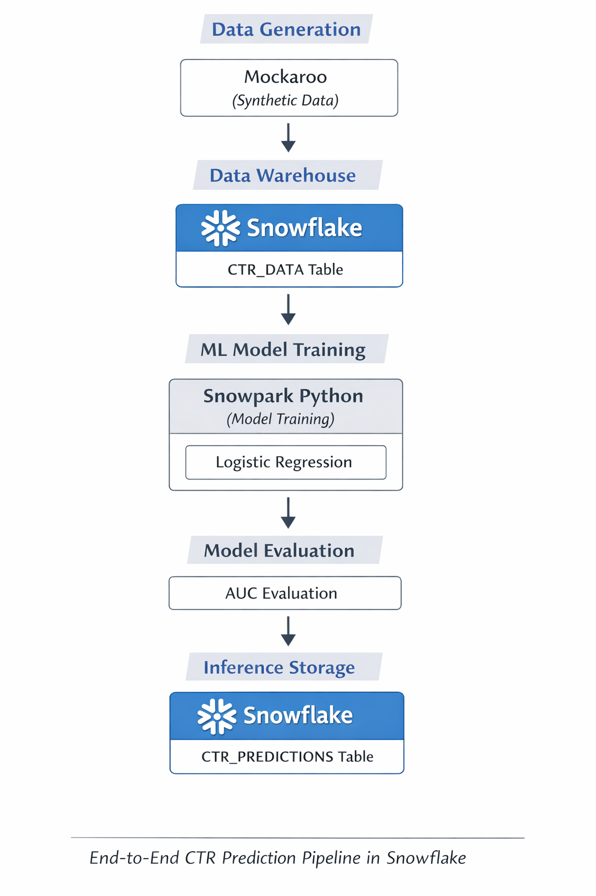
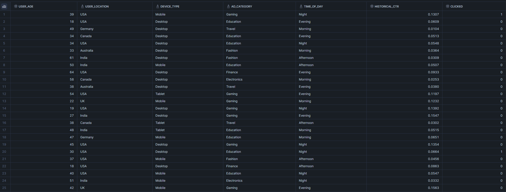
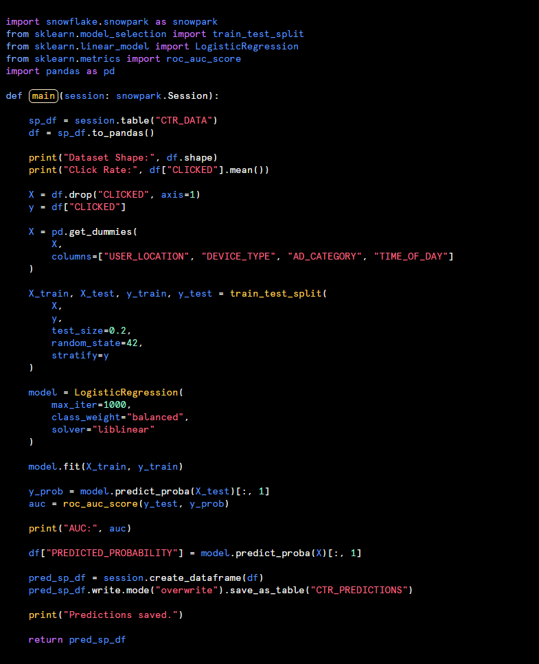
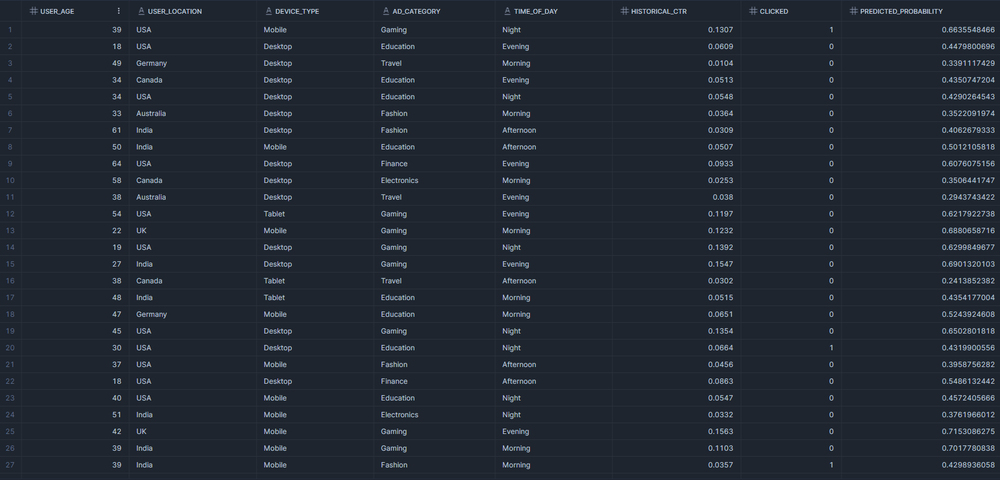

# ❄️ Snowflake CTR Prediction – AI/ML Mini Project

  <b>End-to-End Click-Through Rate (CTR) Prediction Pipeline Built Natively in Snowflake Using Snowpark Python</b>

---

## 📌 Overview

This project demonstrates a complete Click-Through Rate (CTR) prediction pipeline implemented entirely inside Snowflake using Snowpark Python.

The objective is to predict the probability that a user will click on an advertisement, enabling smarter ad ranking, targeting, and revenue optimization.

This POC highlights how Snowflake can function not only as a data warehouse but also as a scalable AI/ML execution platform.

---

## 🎯 Business Problem

Online advertising platforms need to rank users based on their likelihood of clicking ads.

Accurate CTR prediction enables:

- Better ad targeting
- Improved user engagement
- Increased advertising revenue
- Smarter ranking decisions

This project builds a Snowflake-native ML pipeline to predict click probability using structured advertising data.

---

## 🏗 Architecture

  

### 🔄 Pipeline Flow

1. **Synthetic Data Generation** (Mockaroo)
2. **Data Ingestion into Snowflake** → `CTR_DATA`
3. **Model Training using Snowpark Python**
4. **Model Evaluation using AUC**
5. **Predictions written back into Snowflake** → `CTR_PREDICTIONS`

This demonstrates a fully in-database ML workflow.

---

## 📊 Dataset Details

Synthetic advertising dataset includes:

- `USER_AGE`
- `USER_LOCATION`
- `DEVICE_TYPE`
- `AD_CATEGORY`
- `TIME_OF_DAY`
- `HISTORICAL_CTR`
- `CLICKED`

### Dataset Statistics

- Rows: ~5000
- Click Rate: ~6.9%
- Realistic class imbalance

Detailed data generation logic available in:

📄 `data_generation.md`

---

## 🧠 Model Development (Snowpark)

The model was trained directly inside Snowflake using Snowpark Python.

### Model Used

Logistic Regression (class_weight="balanced")

### Why Logistic Regression?

- Experimental comparison performed locally
- Achieved best AUC (~0.66–0.67)
- Dataset signal primarily linear (via HISTORICAL_CTR)
- Stable and interpretable
- Efficient for ranking-based problems

---

## 📈 Model Evaluation

Metric Used:

**AUC (Area Under ROC Curve)**

Final AUC Achieved: ~0.668

This indicates effective ranking performance for predicting click likelihood.

---

## 💾 Prediction Storage (ML Ops Step)

Predictions were written back into Snowflake:

Table Created:CTR_PREDICTIONS

This table contains:

- Original ad data
- Model-generated `PREDICTED_PROBABILITY`

This enables:

- Ranking users by predicted CTR
- Downstream targeting optimization
- Production-style inference workflows

---

## 🔬 Local Model Comparison

The following models were evaluated locally:

- Logistic Regression
- Random Forest
- Gradient Boosting
- XGBoost

Logistic Regression performed best due to the structured and predominantly linear signal within the dataset.

---

## 🚀 Key Highlights

✔ Snowflake-native ML workflow  
✔ Snowpark-based model training  
✔ Class imbalance handling  
✔ Proper AUC-based evaluation  
✔ In-database inference storage  
✔ End-to-end ML lifecycle demonstrated

---

---

## ❄️ Why Snowflake?

This project demonstrates how Snowflake can:

- Serve as both data warehouse and ML execution layer
- Enable in-database model training via Snowpark
- Reduce data movement between systems
- Support scalable AI workflows directly where data resides

It highlights Snowflake's ability to integrate analytics and AI within a unified platform.

---

## 🧩 Future Improvements

- Feature interaction engineering
- Model versioning table
- Automated retraining pipeline
- Snowflake Tasks for scheduling
- CI/CD integration for ML workflows

---

## 📊 Data Loaded into Snowflake

  

## 🧠 Snowpark Model Training & Evaluation

  

## 📈 Predictions Stored in Snowflake

  

## 👨‍💻 Author

**Rahul Mandal**  
AI / ML Engineer  
Bengaluru, India

---

  <i>This project demonstrates how Snowflake can function as an integrated AI/ML platform beyond traditional warehousing.</i>

